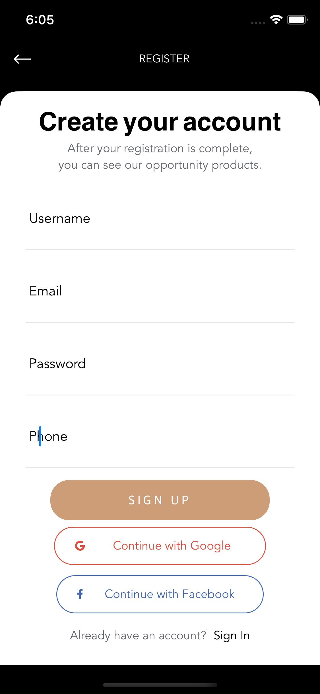

# SwiftUI-example

## [UI](https://www.behance.net/gallery/95200977/90Store-Elements-Ecommerce-FREE-UI-KIT-Pasabahce) inspiared by [ugurates2017](https://www.behance.net/ugurates2017)

|  |  |  |  |  |
|-|-|-|-|-|
|  |  |  |  |  |
|  |  |  |  |  |
|  |  |  |  |  |
|  |  |  |  |  |
|  |  |  |  |  |
